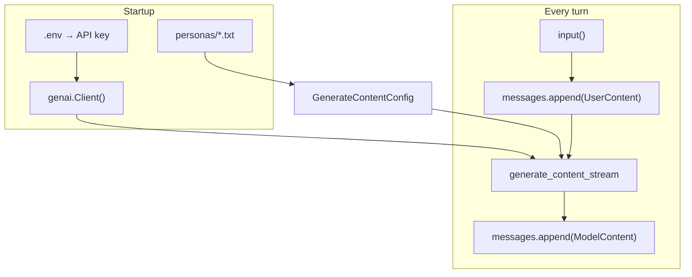

# Persona Chatbot — Build Handover

**Follow-along for Blog 2: Calling an LLM API**  
**Repo:** [github.com/krn1904/AI-chatbot-personas](https://github.com/krn1904/AI-chatbot-personas)

If you read Blog 2 and want to build the project yourself, this document walks through every phase — what to learn, what to code, and how to know you got it. For clone-and-run setup, see [README.md](README.md).

---

## Start here: what you end up with

After Phase 6, you have a **~140-line Python CLI chatbot** that:

- Talks to **Google Gemini** on the free tier
- Remembers the conversation across turns
- Streams replies live to the terminal
- Handles rate limits gracefully
- Swaps personality via a `--persona` flag — same code, different product

No server. No database. One main file plus text files for personas.

### Final project layout

```
AI-chatbot-personas/
├── .env.example         # copy to .env and add your key
├── .gitignore
├── requirements.txt     # google-genai, python-dotenv
├── chatbot.py           # the whole app
├── README.md            # quick start
├── BLOG_HANDOVER.md     # this file
└── personas/
    ├── tutor.txt        # default — Blog 2 tutor
    ├── coach.txt        # interview coach
    ├── recipe.txt       # recipe helper
    └── reviewer.txt     # terse code reviewer
```

### Run it

```bash
python3 -m venv .venv
source .venv/bin/activate          # Windows: .venv\Scripts\activate
pip install -r requirements.txt
cp .env.example .env               # then paste your key from AI Studio

python chatbot.py                  # default tutor
python chatbot.py --persona coach  # interview coach
python chatbot.py --list           # see all personas
```

Type `quit` or `exit` to leave.

---

## The one idea that ties it all together

Every phase adds **one Blog 2 concept** to the same skeleton:

| Concept | Where it lives in code |
|---------|----------------------|
| Config & auth | `.env` + `genai.Client()` |
| Chat completion | `generate_content` / `generate_content_stream` |
| Statelessness | API forgets between calls unless you resend history |
| Memory | `messages` list, resent every turn |
| Persona | `system_instruction` from `personas/*.txt` |
| Streaming | `generate_content_stream` + print chunks |
| Control | `max_output_tokens`, `temperature` |
| Error handling | `try/except` around the API call |
| Reusability | Swap persona file → new tool |

If you can point at any line in `chatbot.py` and name the concept, you understood what Blog 2 was teaching.

---

## How to approach the build

### Learn first, build second

The project is split into **phases**, not features. Work through them in order. Each phase follows the same rhythm:

1. **Concept** — understand the idea and why it exists
2. **Observe** — run the code and notice the behavior (especially when something “breaks” on purpose)
3. **Implement** — make one small change
4. **Checkpoint** — explain what changed in your own words before moving on

One phase per sitting is enough. Do not skip ahead — Phase 2’s “forgetting” only makes sense if you feel it before adding memory in Phase 3.

### Provider: Google Gemini

- Free tier, no credit card
- Official SDK: `google-genai`
- Recommended models: **`gemini-2.5-flash-lite`** or **`gemini-2.5-flash`**

**Gotcha:** `gemini-2.0-flash` may return `429 RESOURCE_EXHAUSTED` with `limit: 0` on the free tier — the model is not available for your API key. Switch to `gemini-2.5-flash` or `gemini-2.5-flash-lite`. A different `429` (`limit: 20`, retry in ~60s) is a **temporary rate limit** from too many requests per minute — wait and try again.

---

## Phase-by-phase walkthrough

### Phase 0 — Setup

**Learn:** API keys, clients, and why secrets live in `.env`.

**Build:**
- Virtual environment (`.venv/`)
- `requirements.txt` with `google-genai` and `python-dotenv`
- `.gitignore` for `.env` and `.venv`
- Skeleton `chatbot.py`: load key, create `genai.Client()`

**Checkpoint:** Why is the API key in `.env` and not in source code?

**Answer:** So it never gets committed to git. Leaked keys get abused fast.

**Files explained:**
- `requirements.txt` — shopping list of packages (“this project needs these libraries”)
- `.venv/` — where those packages are installed, isolated per project

---

### Phase 1 — Hello, model

**Learn:** The smallest possible request. One message in, one reply out.

**Build:**
- Hardcoded `contents="Say hello in one sentence."`
- `client.models.generate_content(model=..., contents=...)`
- `print(response.text)`

**Checkpoint:** Trace the path: client → API call → `response.text`.

This proves auth, SDK, and model name all work before adding a loop.

---

### Phase 2 — The loop (no memory)

**Learn:** **Statelessness.** The model does not remember the previous turn.

**Build:**
- `while True:` + `input("You: ")`
- Each turn: send **only** the latest user message
- Basic `quit` to exit

**Exercise (do this before Phase 3):**
1. `My name is Karan.`
2. `What's my name?`

The bot forgets. **That is not a bug.** Turn 1 worked for “Karan” only because the name was *in the same message*. Turn 2 sent only `"What's my name?"` — no history.

**Checkpoint:** The API has no memory. If you don’t resend prior messages, the model can’t know them.

---

### Phase 3 — Memory

**Learn:** **You** are the memory. Resend the full conversation every turn.

**Build:**
- `messages: list[types.Content] = []`
- Each turn: append `UserContent` → call API with full `messages` → append `ModelContent` reply

**After each turn the list looks like:**
```
[user, model, user, model, ...]
```

Re-run the name exercise — it should remember.

**Side note:** Longer chats send more tokens every turn and hit limits faster. Trimming old messages is covered in the stretch goals below.

**Checkpoint:** Memory is the `messages` list, resent on every call.

---

### Phase 4 — Persona

**Learn:** The system message is the cheapest product lever.

**Build:**
- `SYSTEM_PROMPT` string defining character and rules
- `GenerateContentConfig(system_instruction=SYSTEM_PROMPT)`

Same loop. Same memory. Different behavior.

**Exercise:** Change only the system prompt text. Ask the same question. Watch the tone shift.

**Checkpoint:** The persona lives in one string (later: one file). The engine didn’t change.

---

### Phase 5 — Polish

**Learn:** Production-ish CLI habits without a server.

**Build:**

| Piece | What it does |
|-------|----------------|
| `quit` / `exit` | Clean exit |
| `generate_content_stream` | Reply types out live |
| `max_output_tokens` | Cap reply length |
| `temperature` | Low = steady, high = creative |
| `try/except` | Friendly errors on 429 and server failures |

**`stream_reply()` — the function worth understanding:**

```python
def stream_reply(messages, config) -> str:
    print("Bot: ", end="", flush=True)
    parts = []
    for chunk in client.models.generate_content_stream(...):
        if chunk.text:
            print(chunk.text, end="", flush=True)  # show live
            parts.append(chunk.text)               # save for memory
    print("\n")
    return "".join(parts)                          # full reply for messages list
```

Streaming is for **display**. You still collect the full reply string so Phase 3 memory keeps working.

**Checkpoint:** You can label every block in `chatbot.py` with its Blog 2 concept.

---

### Phase 6 — Make it yours

**Learn:** Same engine, new system message = new product.

**Build:**
- `personas/` folder with one `.txt` file per character
- `load_persona(name)` reads the file
- `--persona coach` CLI flag via `argparse`
- `--list` shows available personas

**Add a new bot:**
1. Create `personas/yoga.txt` with a system prompt
2. Run `python chatbot.py --persona yoga`

No changes to the loop, streaming, or error handling.

**Takeaway:** The chat loop, memory, streaming, and error handling stay the same from Phase 3 through 5. Only the system message changes. Swap `personas/coach.txt` for `personas/reviewer.txt` and you get a different tool without touching the engine. The infrastructure is generic; the persona is specific.

---

## Architecture at a glance



---

## Gotchas (from real builds)

1. **Never commit `.env`.** Add it to `.gitignore` on day one.
2. **Wrong model on free tier.** If you see `429` with `limit: 0`, try `gemini-2.5-flash` or `gemini-2.5-flash-lite`.
3. **Rate limits are normal.** `429` with “retry in 60s” means wait — that’s what Phase 5 error handling is for.
4. **Phase 2 “forgetting” is the lesson.** Don’t skip to memory until you’ve felt it.
5. **Streaming without collecting chunks breaks memory.** Always `join(parts)` before appending to `messages`.
6. **Gemini uses `model` role**, not `assistant` (OpenAI’s name).

---

## Concept map: what you read ↔ what you build

| Blog 2 concept | Phase | Where in code |
|----------------|-------|---------------|
| API key & client | 0 | `load_dotenv()`, `genai.Client()` |
| One completion call | 1 | `generate_content()` |
| Stateless model | 2 | `contents=user_input` only |
| Message history | 3 | `messages` list |
| System message | 4 | `system_instruction` |
| Streaming | 5 | `generate_content_stream()` |
| max_tokens / temperature | 5 | `GenerateContentConfig` |
| Error handling | 5 | `except errors.ClientError` |
| Swap the persona | 6 | `personas/*.txt`, `--persona` |

---

## What success looks like

You’re done with the core path when you can:

1. Run the bot from terminal with streaming and a chosen persona
2. Explain why Phase 2 forgot and Phase 3 fixed it
3. Change only a persona file and get a different “product”
4. Handle a rate-limit error without panic

---

## Optional stretch goals

If you want to keep building after Phase 6:

- **Save/load conversations** — write `messages` to JSON, reload on startup
- **Streamlit web UI** — wrap the same loop in a simple web interface
- **Trim old messages** — when the list gets long, drop middle turns (context window practice)
- **Ollama** — same four-part structure, local model, no API key

---

## Quick reference: dependencies

```
google-genai      # Official Gemini SDK
python-dotenv     # Load .env without hardcoding secrets
```

Python 3.9+ recommended. Tested on Python 3.13.

---

*Phases 0–6 complete. Provider: Google Gemini. One concept per phase.*
